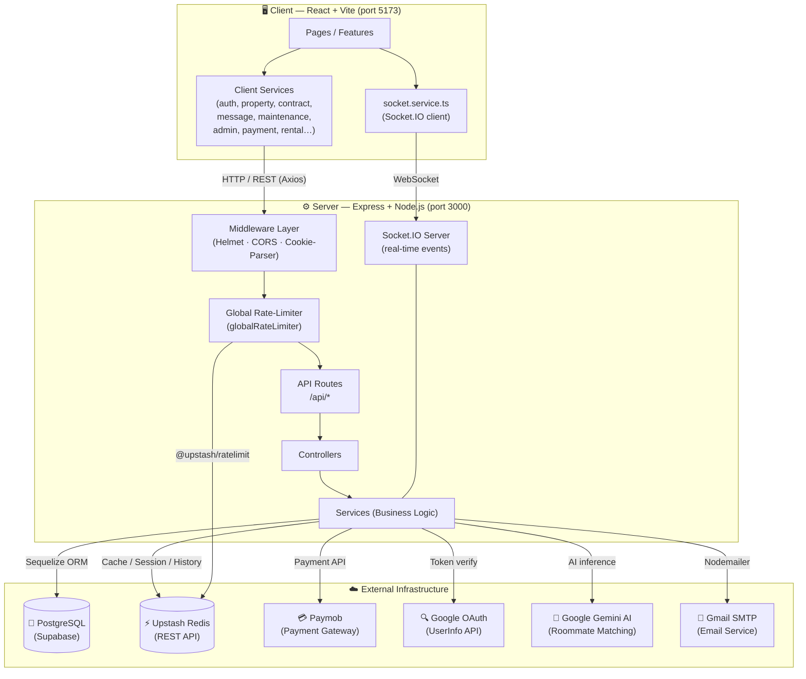
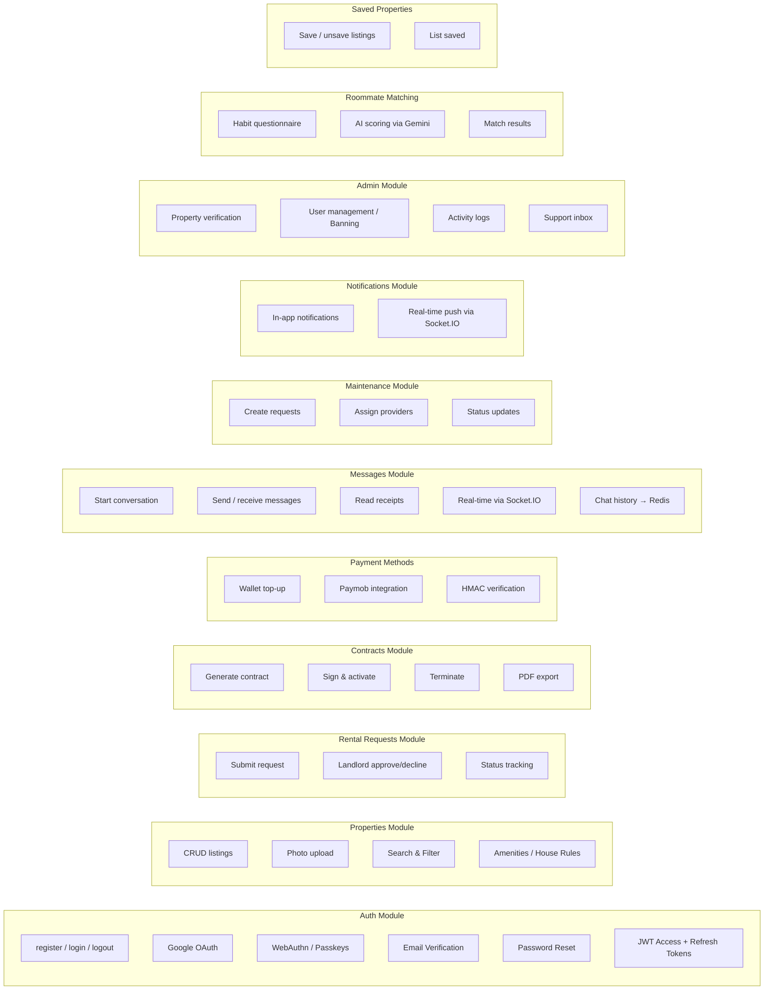
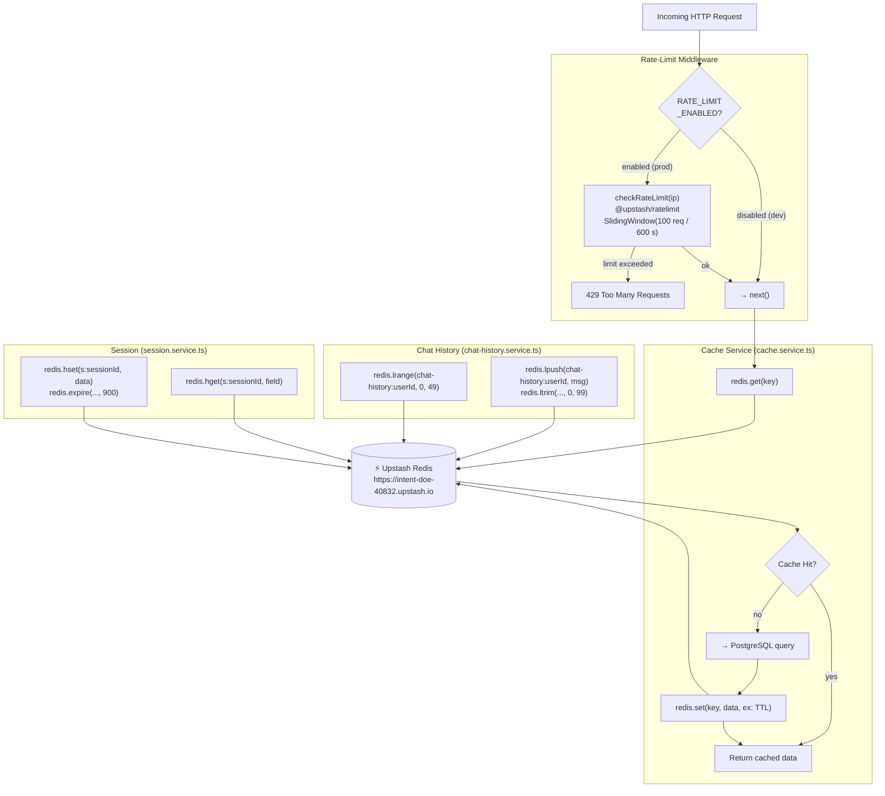
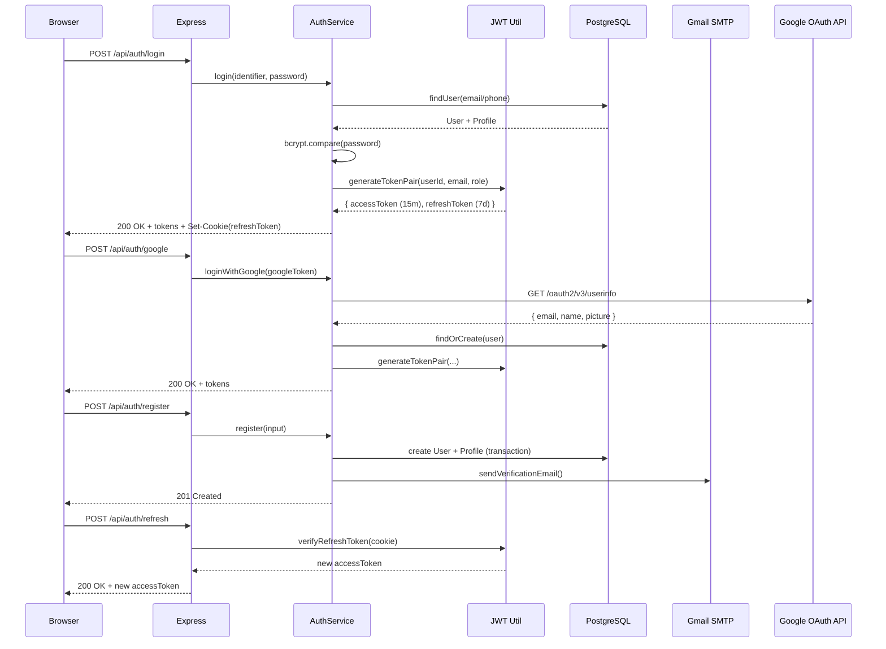
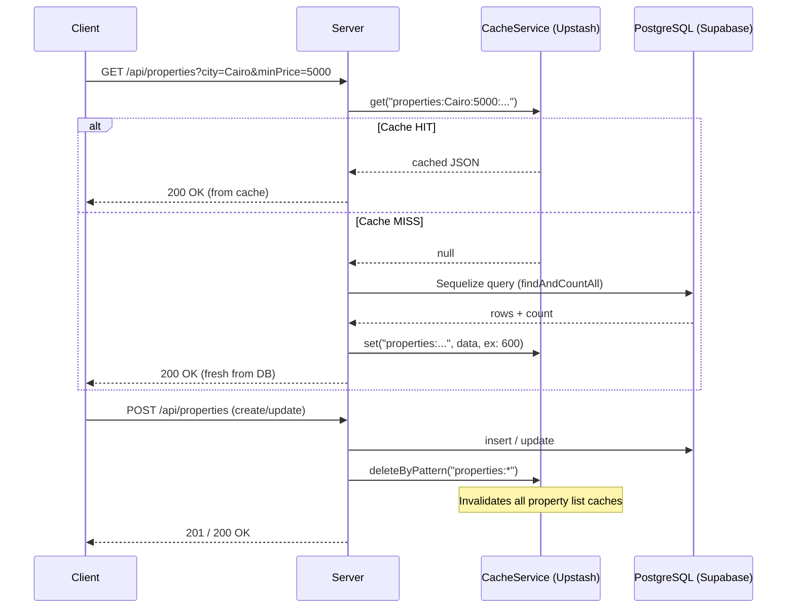
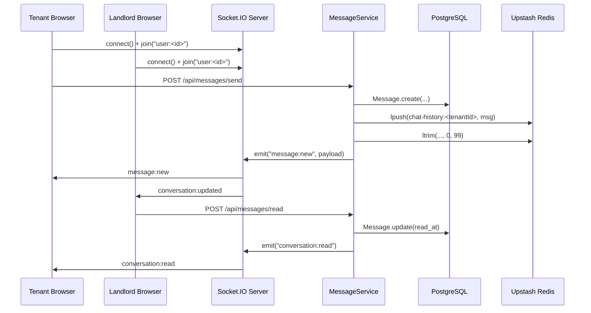
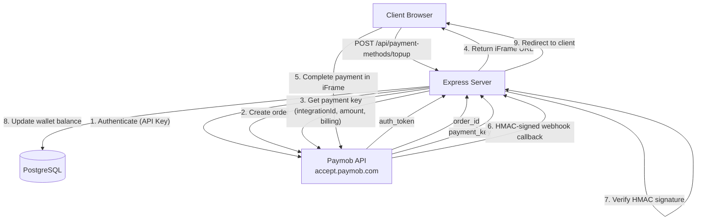
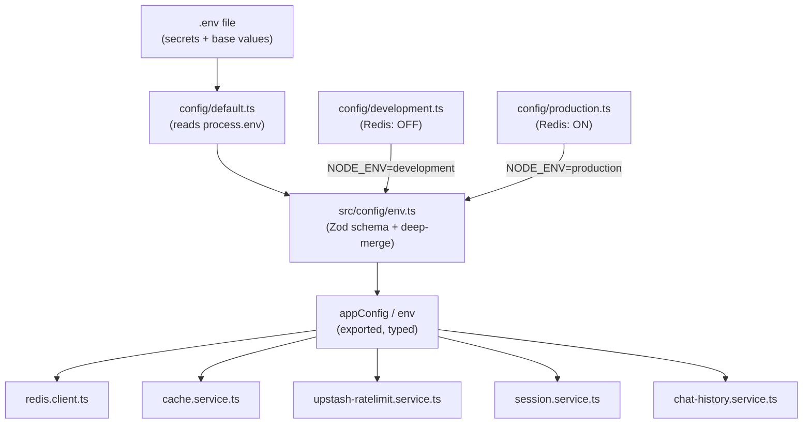
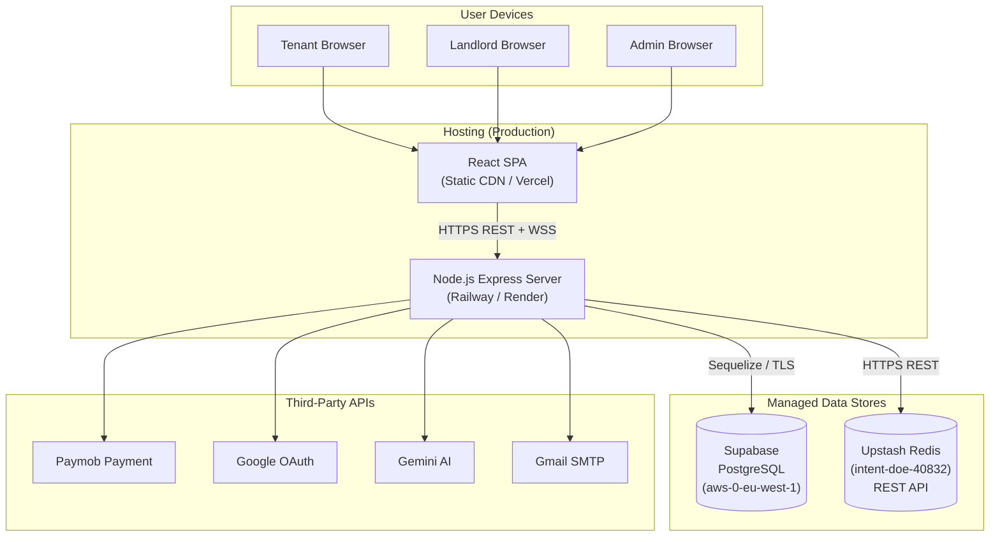

# HOMi — Complete System Architecture

> **Diagram-as-Code** using [Mermaid](https://mermaid.js.org/).  
> Render in GitHub, VS Code (Mermaid Preview), or any Mermaid-compatible viewer.

---

## 1. High-Level System Overview

---

## 2. Backend Module Map

---

## 3. Redis Caching Layer (Upstash)

---

## 4. Authentication & Security Flow

---

## 5. Property Listing & Caching Flow

---

## 6. Real-Time Messaging Flow

---

## 7. Payment Flow (Paymob)

---

## 8. Environment & Configuration Layering

---

## 9. Infrastructure & Deployment Overview

---

## Key Architecture Decisions

| Concern | Solution |
|---|---|
| **Caching** | Upstash Redis `SET`/`GET` — property lists, popular items, query results |
| **Chat History** | Upstash `LPUSH`/`LTRIM` — last 100 messages per user, O(1) writes |
| **Rate Limiting** | `@upstash/ratelimit` Sliding Window — 100 req / 600 s per IP |
| **Sessions** | Upstash `HSET`/`HGET`/`EXPIRE` — 15-min sliding TTL hash store |
| **Real-time** | Socket.IO over `ws://` — conversation rooms + user rooms |
| **Auth** | JWT (15 m access + 7 d refresh in HttpOnly cookie) + Google OAuth + WebAuthn |
| **ORM** | Sequelize v6 with PostgreSQL via Supabase Session Pooler |
| **Dev vs Prod** | Redis **disabled** in `development.ts`, **enabled** in `production.ts` |
